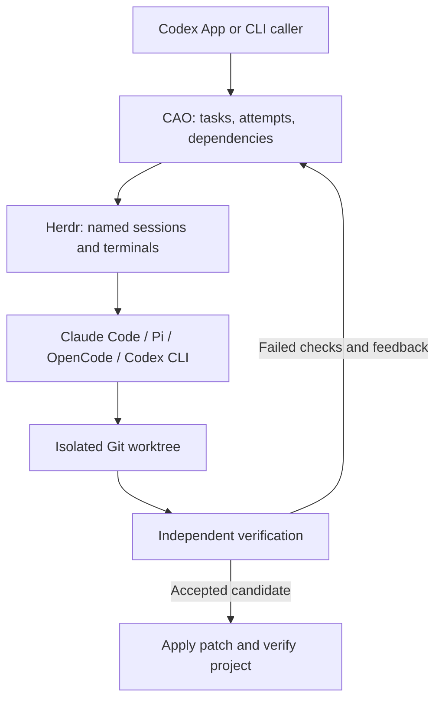

# Codex Agent Orchestrator

**AI coding agent orchestration with Herdr, Git worktrees, and independent verification.**

[](https://github.com/Snseam/codex-agent-orchestrator/actions/workflows/ci.yml)
[](https://nodejs.org/)
[](LICENSE)

**English** · [简体中文](README.zh-CN.md)

[Quick start](#quick-start) · [How it works](#how-it-works) · [Execution profiles](#execution-profiles) · [Agent support](#agent-support) · [Token usage](#token-usage) · [Documentation](#documentation) · [Contributing](CONTRIBUTING.md)

Codex Agent Orchestrator (**CAO**) is a local, zero-dependency Node.js CLI for coordinating coding agents through [Herdr](https://github.com/herdrdev/herdr). Let Codex App or Codex CLI plan the work, assign scoped tasks to Claude Code or other agent sessions, and verify their changes before integrating them into your project.

> **Early preview.** The base Claude Code workflow has passed local end-to-end tests, including controlled failure and repair. Profiled execution has also been checked with Herdr 0.9+ using two Claude sessions against a local Anthropic-compatible test server. Codex and Pi profile requests have passed local mock API checks; their complete Herdr workflows and OpenCode remain unverified. Large-scale speed, quality, and cost effects have not been measured.

## Why CAO?

- **Coordinate existing agents.** Use Herdr-managed sessions while preserving each CLI's provider and model configuration.
- **Choose execution profiles.** Route tasks to native Claude, Codex, Pi, or OpenCode profiles with local relay gateways, stored secrets, fallbacks, and capacity reservations.
- **Isolate parallel work.** Assign independent tasks separate Git worktrees, declared file ownership, dependencies, and run capacity.
- **Verify actual changes.** Check result identity and file scope, stop the worker, then run your acceptance commands against its candidate.
- **Repair with evidence.** Start a new attempt with failed check output and the previous worktree's changes intact.
- **Integrate with checks.** Detect changed target files, apply the verified patch, and rerun acceptance commands in the project checkout.
- **Keep work inspectable.** Save tasks, prompts, results, terminal output, patches, and verification logs locally.

## How it works



Codex decides what to build and how to divide the work. CAO manages the task lifecycle; Herdr runs the interactive terminals. The selected coding agent uses the tools available in its own installation.

```text
dispatch → collect → verify → integrate
                       ↓
                     retry → collect → verify
```

Each stage is an explicit CLI command. Task submission is not completion: `collect` requires an attempt-specific result, and `verify` runs checks independently of the agent's claims.

## Quick start

### 1. Prerequisites

- **Node.js 22.13+** and **Git**.
- [Herdr](https://github.com/herdrdev/herdr) installed and available on `PATH`.
- A supported coding agent CLI, already configured with its provider and credentials.
- A target Git repository with at least one commit.

Live agent workflows have been tested on macOS. CI checks the offline suite on macOS and Linux; that does not establish live Herdr compatibility on every platform.

### 2. Run from source

```bash
git clone https://github.com/Snseam/codex-agent-orchestrator.git
cd codex-agent-orchestrator
node bin/cao.mjs doctor
```

No `npm install` is needed. There is currently no published npm package.

Try a self-contained workflow with your configured Claude Code:

```bash
npm run smoke -- --live --happy
```

This creates a disposable Git project, fixes a small function in a worktree, verifies and integrates the change, then stops its Herdr session. A new directory may need a trust confirmation. If it pauses, inspect the saved run before supplying input; see [task states and recovery](docs/states.md).

### 3. Assign work in your project

Replace the example path with your target repository:

```bash
node bin/cao.mjs init --project /path/to/your-repo --id demo --max-parallel 2
mkdir -p work
```

Save the following as `work/task.json` in the CAO checkout. This example assumes your target has `src/math.mjs` and `tests/math.test.mjs`; adapt the objective, allowed paths, and checks to your project.

```json
{
  "id": "fix-add",
  "objective": "Fix add(a, b) to return the sum. Preserve the existing API and tests.",
  "agent": "claude",
  "allowedPaths": ["src/math.mjs"],
  "checks": [
    {
      "name": "math tests",
      "argv": ["node", "--test", "tests/math.test.mjs"],
      "timeoutMs": 60000
    }
  ],
  "isolation": "worktree",
  "maxAttempts": 3,
  "maxChildren": 0
}
```

Validate and dispatch:

```bash
node bin/cao.mjs validate --file work/task.json
node bin/cao.mjs dispatch --run demo --file work/task.json
node bin/cao.mjs collect --run demo --task fix-add --wait-ms 30000
```

Check the returned state before advancing. Repeat `collect` while running; use `inspect --output` when input is needed. At `submitted`, run independent verification:

```bash
node bin/cao.mjs verify --run demo --task fix-add
```

If the result is `rework`, start a repair attempt, then collect and verify it again:

```bash
node bin/cao.mjs retry --run demo --task fix-add
```

At `accepted`, integrate the candidate. Close the run after all tasks finish or are cancelled:

```bash
node bin/cao.mjs integrate --run demo --task fix-add
node bin/cao.mjs cleanup --run demo
```

By default, commands return JSON, with errors on stderr; `--help` prints usage. State lives outside the target project, by default under `~/.local/state/codex-agent-orchestrator` or `$XDG_STATE_HOME/codex-agent-orchestrator`. Use the same `--state-dir` across commands and runs that coordinate one project.

## Execution profiles

Execution profiles are optional. They let CAO select a native agent, model, upstream endpoint, credential reference, and routing policy per task while keeping global provider files unchanged. Profiles can be authored directly or imported from a read-only CC Switch database. Stored secrets are read from stdin or environment references; secret values are never stored in profile JSON.

Useful commands:

```bash
node bin/cao.mjs profile put --file profile.json --default
printf '%s\n' "$ANTHROPIC_API_KEY" | node bin/cao.mjs secret set --id anthropic-main --stdin
node bin/cao.mjs source discover --directory ~/.cc-switch
node bin/cao.mjs profile import-cc-switch --provider claude-main --app claude --id claude-main
node bin/cao.mjs route explain --file work/task.json
node bin/cao.mjs gateway list
```

Routing supports fixed profiles and automatic `agent: "auto"` selection. A default profile is an execution selector too: if a legacy task omits `execution`, CAO can use the default profile, including for `agent: "auto"`. With a concrete task agent, the default must still be compatible with that agent.

The first CC Switch source adapter targets schema version 18 and supports direct Claude API records from `settings_config.env` plus explicit `--allow-shared` reuse of the active Claude proxy. OAuth-only and non-Claude records are listed as unsupported rather than imported as direct profiles. See [execution profiles and routing](docs/execution-profiles.md).

## Agent support

| Agent | Task value | Current validation |
| --- | --- | --- |
| Claude Code | `claude` | Local live workflow and controlled repair verified; profiled local relay verified with a simulated Anthropic API |
| Pi | `pi` | Native CLI profile request verified against a mock API; complete Herdr workflow not yet verified |
| OpenCode | `opencode` | Launch and profiled runtime adapter implemented; live workflow not yet verified |
| Codex CLI | `codex` | Native CLI profile request verified against a mock API; complete Herdr workflow not yet verified |

`agentArgs` forwards CLI-specific options in inherited mode. Profiled tasks reject arguments that would conflict with profile-owned model, provider, session, config, or worktree settings; Codex allows selected reasoning and verbosity `-c` overrides. `nativeInstructions` describes how a worker should use its available native tools. `maxChildren` is a reporting contract, not a measured or enforced count of running subagents. See the [adapter architecture](docs/architecture.md) and [execution profiles](docs/execution-profiles.md).

## Token usage

CAO can query local token records through the optional external Tokscale CLI. Tokscale is not a CAO runtime dependency; install it separately if you want reports:

```bash
npm install -g @tokscale/cli@4.16.0
node bin/cao.mjs usage --today
```

Use `--tokscale-bin /path/to/tokscale` or `CAO_TOKSCALE_BIN=/path/to/tokscale` when the binary is not on `PATH`. JSON is the default output; add `--table` for a compact terminal view. Machine reports cover local records for `claude`, `codex`, `pi`, and `opencode`. Run/task reports are workspace-scoped and always set `attribution.exactTaskAttribution: false`; they do not prove exact causal task usage. CAO calls only Tokscale local `models --json` reports, omits costs, and never calls Tokscale `submit`, `autosubmit`, `usage`, or any model. See [token usage reports](docs/usage.md).

## Verification and boundaries

- CAO is explicitly driven by its caller; it has no background scheduler, MCP server, or native subagent telemetry.
- Worktrees and `allowedPaths` are coordination controls, not a filesystem sandbox. Ignored untracked files and external side effects are outside the Git snapshot.
- Failed integration can leave edits in the project. CAO blocks new work for that project until recovery succeeds; `recover` rechecks the current checkout without applying the patch again.
- Direct `checkout` tasks can retain unverified edits too. Retry that task or recover after its worker stops. Shared project locks require one state directory.
- Interrupted verification fails closed and needs process/evidence inspection. `resume` does not blindly resend work or replay checks.
- CAO does not automatically commit, push, publish, install dependencies, or change model providers.

Validation evidence includes offline tests, explicit Herdr checks, base Claude Code live scenarios, and a profiled execution smoke with Herdr 0.9+ using two Claude sessions against a local simulated Anthropic API. The profiled smoke covered separate profile model/key routing, Read/Write/Bash/tool submission, independent acceptance, 16 matched gateway requests, unchanged global provider files, and runtime release. This is functional integration evidence, not a measurement of real model quality, provider billing, or production reliability.

## Development

```bash
npm test                         # Offline tests; no agent credentials needed
npm run check                    # Syntax checks
npm run test:herdr                # Requires Herdr; does not start an agent
npm run smoke -- --live           # Controlled failure → repair → integration
```

Plain `npm run smoke` only prints instructions. Live smoke tests use your configured agent and may incur provider charges. Read [CONTRIBUTING.md](CONTRIBUTING.md) before changing runtime or recovery behavior.

## Documentation

| Resource | Contents |
| --- | --- |
| [Architecture](docs/architecture.md) | CLI, state store, Herdr runtime, Git isolation, verification, profiled execution |
| [Execution profiles and routing](docs/execution-profiles.md) | Profile CRUD, secrets, CC Switch import, routing, gateway lifecycle |
| [Task states and recovery](docs/states.md) | Result contract, retries, interaction, checkout and integration holds |
| [Token usage reports](docs/usage.md) | Optional Tokscale integration, JSON shape, attribution boundaries |
| [Codex skill draft](skills/herdr-dev/SKILL.md) | Guidance for driving CAO from Codex; not installed automatically |
| [Changelog](CHANGELOG.md) | Release history |
| [中文文档](README.zh-CN.md) | Chinese overview and getting started |

## Contributing and support

Bug reports, documentation fixes, and focused pull requests are welcome. Read the [contribution guidelines](CONTRIBUTING.md) and [code of conduct](CODE_OF_CONDUCT.md), then [open an issue](https://github.com/Snseam/codex-agent-orchestrator/issues/new/choose).

For security vulnerabilities, follow [SECURITY.md](SECURITY.md) and use private reporting instead of public issues.

Maintained by [Snseam](https://github.com/Snseam). CAO is an independent project integrating with existing coding tools.

## License

[Apache License 2.0](LICENSE). Copyright 2026 Snseam. See [NOTICE](NOTICE).
