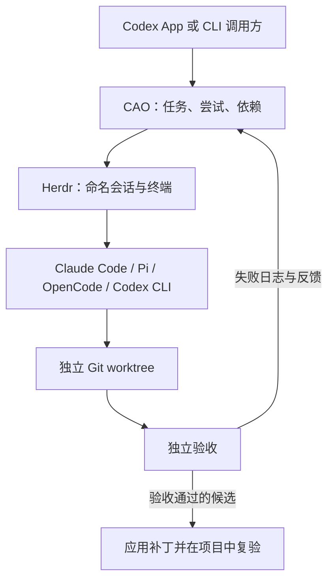

# Codex Agent Orchestrator

**基于 Herdr、Git worktree 和独立验收的 AI 编程 Agent 协调工具。**

[](https://github.com/Snseam/codex-agent-orchestrator/actions/workflows/ci.yml)
[](https://nodejs.org/)
[](LICENSE)

[English](README.md) · **简体中文**

[复制到 Codex 即可开始](#在-codex-对话中直接开始) · [CLI 快速开始](#快速开始) · [工作原理](#工作原理) · [执行配置](#执行配置) · [Agent 支持](#agent-支持) · [Token 用量](#token-用量) · [文档](#文档) · [参与贡献](CONTRIBUTING.md)

Codex Agent Orchestrator（**CAO**）是本地运行、零运行依赖的 Node.js CLI，通过 [Herdr](https://github.com/herdrdev/herdr) 协调多个编程 Agent。由 Codex App 或 Codex CLI 规划工作，将范围明确的任务分配给 Claude Code 或其他 Agent 会话，独立验收通过后再整合到项目。

> **早期预览。** 基础 Claude Code 流程已通过本机端到端测试，包含受控失败与修复。Profiled execution 也已用 Herdr 0.9+ 和两个 Claude session 针对本地 Anthropic 兼容测试服务检查。Codex 和 Pi 的原生 CLI 配置请求已通过本地模拟 API 检查；它们的完整 Herdr 流程和 OpenCode 尚未实测。大规模速度、质量和成本效果尚未测量。

## 在 Codex 对话中直接开始

**复制一次，后面正常提需求。** 下面的指令会要求 Codex 在当前对话的后续开发任务中默认使用 CAO。你不需要自己编写任务 JSON、逐条运行 CLI，也不需要先全局安装技能。

1. 在 Codex App 或 Codex CLI 中打开一个**新的或已有的本地对话**，确保它能访问你的项目文件和终端。
2. 完整复制下面的指令。可以保留默认值，也可以修改项目、执行 Agent 和数量限制。
3. Codex 确认就绪后，直接提出开发需求。也可以将第一项需求附在同一条消息末尾。

```text
从现在开始，当前对话中的开发任务默认通过 Codex Agent Orchestrator（CAO）执行，直到我明确要求关闭。这个偏好只适用于当前对话。

目标项目：使用当前项目；仅在无法确定时询问项目路径。
执行 Agent：有兼容的 CAO profile 时复用；否则使用我已经配置好的 Claude Code。
最大外部并发会话数：2。
每个任务最多尝试次数：3。

先完成准备：
- 查找并复用本机已有的 CAO 仓库；如果没有，从 https://github.com/Snseam/codex-agent-orchestrator 克隆到目标项目以外的空闲目录，并报告路径。保留已有文件。
- 阅读仓库中的 README.md 和 skills/herdr-dev/SKILL.md，确定 bin/cao.mjs 的绝对路径，检查 --help 和 doctor。通过 node 调用该路径，不依赖全局 cao 命令或技能安装。
- 检查目标 Git 仓库、已安装 Agent，以及现有 CAO profiles/default。使用同一个位于目标项目外的 CAO 状态目录。若缺少必要依赖、登录、初始 Git 提交或权限，说明具体阻塞和最小处理步骤；不能假装已启用，也不能悄悄改用其他流程。
- 保留现有 Agent 和 CC Switch 的提供商及认证配置，不为了启用这个偏好而安装依赖或改写全局配置。

后续开发时：
- 由你负责需求分析、任务拆分、验收条件、评审和最终整合；自行生成任务文件并驱动 CAO，将实现工作交给 CAO 管理的会话。
- 独立任务使用独立 worktree，明确修改范围并遵守依赖关系；仅在实际支持且有帮助时请求 Agent 的原生内部协作。
- 持续推进 dispatch → collect → verify，按证据在尝试次数内修复，再整合已验收的修改并进行项目级复验。不能把终端 idle 或 Agent 自报成功当作验收通过。
- 遇到 needs_input 或结果不确定时先检查，不盲目重发任务。完成或取消后停止并清理所属会话，保留证据。
- 在当前对话的交接摘要中保留 CAO CLI 路径、项目、状态目录、run/task ID 和本偏好；中断恢复时先检查已有 run。
- 普通问答和方案讨论直接回答，不启动 worker。开发任务无法使用 CAO 时先说明原因，不悄悄绕过。遵循我的后续指令，以及已有的提交、发布授权范围。

如果我没有同时给出开发需求，本次只检查就绪状态，报告实际路径、所选 Agent/profile 和阻塞项，然后等待下一条需求。
```

准备好之后，直接这样提需求即可：

```text
给当前项目增加 CSV 导入功能，处理重复行和格式错误，补充回归测试，完成整合并通过检查。
```

| 你想做什么 | 在当前对话中发送 |
| --- | --- |
| 查看进度 | “显示当前 CAO run、各任务状态和阻塞原因。” |
| 更换执行 Agent | “后续 CAO 任务使用我已经配置好的 Pi，先检查兼容性。” |
| 单次直接开发 | “仅这次任务不使用 CAO，由你直接完成。” |
| 关闭默认使用 | “当前对话不再默认使用 CAO。若有正在执行的 CAO 工作，先检查并安全停止，保留修改和证据。” |
| 重新启用 | “当前对话的后续开发任务重新默认使用 CAO。” |

这是**当前对话中的工作指令**，不会修改整个账号的默认设置，也不会创建后台调度器。换一个对话时需要重新粘贴；Codex 停止运行后，也不保证编排流程继续推进。若在另一个对话中接续已有 run，同时提供项目路径、状态目录和 run ID，让 Codex 先检查已有状态，避免重复启动。

指令可以获取 CAO 本身，但运行仍需要 Node.js 22.13+、Git、Herdr、已配置的受支持 Agent，以及至少有一次提交的目标仓库；缺少条件时 Codex 会在准备阶段报告。从零开发时，请明确要求先创建 Git 项目骨架和初始提交。需要手动操作时，继续阅读 [CLI 快速开始](#快速开始)或[执行配置教程](docs/zh-CN/execution-profiles.md)。

## 为什么使用 CAO？

- **复用已有 Agent。** 通过 Herdr 管理会话，保留各 CLI 的模型和提供商配置。
- **选择执行配置。** 将任务路由到 Claude、Codex、Pi 或 OpenCode 原生 profile，并使用本地 relay gateway、stored secret、fallback 和容量预约。
- **隔离并行工作。** 为独立任务分配 Git worktree，声明修改范围、依赖和运行容量。
- **验收实际修改。** 校验结果身份与文件范围，停止 worker 后独立执行验收命令。
- **根据证据修复。** 新尝试接收失败日志，并保留前一次 worktree 中的修改。
- **检查后再整合。** 检查目标文件是否变化，应用已验收补丁，再在项目中复验。
- **保留可检查的记录。** 本地保存任务、提示、结果、终端输出、补丁和验证日志。

## 工作原理



Codex 决定做什么、如何分工；CAO 管理任务生命周期；Herdr 运行交互终端。被选中的 Agent 使用本机安装中实际可用的工具完成任务。

```text
dispatch → collect → verify → integrate
                       ↓
                     retry → collect → verify
```

每个阶段由明确的 CLI 命令驱动。派发成功不等于任务完成：`collect` 需要当前尝试的有效结果文件，`verify` 独立运行检查，不以 Agent 自报成功作为验收结论。

## 快速开始

### 1. 准备环境

- **Node.js 22.13+** 和 **Git**。
- 已安装 [Herdr](https://github.com/herdrdev/herdr)，且可从 `PATH` 调用。
- 一个已配置提供商和凭证的受支持编程 Agent CLI。
- 至少包含一个 commit 的目标 Git 仓库。

真实 Agent 流程在 macOS 上实测。CI 在 macOS 和 Linux 上检查离线测试；这不代表已验证各平台上的真实 Herdr 工作流。

### 2. 从源码运行

```bash
git clone https://github.com/Snseam/codex-agent-orchestrator.git
cd codex-agent-orchestrator
node bin/cao.mjs doctor
```

不需要 `npm install`，目前没有发布 npm 包。

使用本机已配置的 Claude Code，运行一个独立完整示例：

```bash
npm run smoke -- --live --happy
```

脚本创建测试 Git 项目，在 worktree 中修复一个小函数，完成验收与集成，然后停止对应 Herdr 会话。首次访问目录可能需要确认信任。若脚本暂停，应先检查保存的 run，再提供具体输入，详见[任务状态与恢复](docs/zh-CN/states.md)。

### 3. 在自己的项目中分配任务

将示例路径替换为你的目标仓库：

```bash
node bin/cao.mjs init --project /path/to/your-repo --id demo --max-parallel 2
mkdir -p work
```

将下方内容保存为 CAO 仓库中的 `work/task.json`。该例假设目标项目已有 `src/math.mjs` 和 `tests/math.test.mjs`；请按实际项目修改目标、允许路径和检查命令。

```json
{
  "id": "fix-add",
  "objective": "修复 add(a, b)，使其返回两数之和。保持现有 API 和测试不变。",
  "agent": "claude",
  "allowedPaths": ["src/math.mjs"],
  "checks": [
    {
      "name": "math tests",
      "argv": ["node", "--test", "tests/math.test.mjs"],
      "timeoutMs": 60000
    }
  ],
  "isolation": "worktree",
  "maxAttempts": 3,
  "maxChildren": 0
}
```

校验并派发任务：

```bash
node bin/cao.mjs validate --file work/task.json
node bin/cao.mjs dispatch --run demo --file work/task.json
node bin/cao.mjs collect --run demo --task fix-add --wait-ms 30000
```

根据返回状态推进流程。任务运行时继续 `collect`，需要输入时先用 `inspect --output` 查看。状态为 `submitted` 后独立验收：

```bash
node bin/cao.mjs verify --run demo --task fix-add
```

返回 `rework` 时创建修复尝试，再重新收集和验收：

```bash
node bin/cao.mjs retry --run demo --task fix-add
```

候选状态为 `accepted` 后整合补丁。所有任务完成或取消后关闭 run：

```bash
node bin/cao.mjs integrate --run demo --task fix-add
node bin/cao.mjs cleanup --run demo
```

命令默认返回 JSON，错误写入 stderr；`--help` 显示用法。状态保存在目标项目外，默认位于 `~/.local/state/codex-agent-orchestrator` 或 `$XDG_STATE_HOME/codex-agent-orchestrator`。协调同一项目的命令和 run 应使用相同 `--state-dir`。

## 执行配置

Execution profile 是可选能力。它让 CAO 为每个任务选择原生 agent、模型、上游 endpoint、凭证引用和路由策略，同时不改写全局 provider 文件。Profile 可以手写，也可以从只读 CC Switch 数据库导入。stored secret 从 stdin 或环境变量引用读取；secret 值不会写入 profile JSON。

常用命令：

```bash
node bin/cao.mjs profile put --file profile.json --default
printf '%s\n' "$ANTHROPIC_API_KEY" | node bin/cao.mjs secret set --id anthropic-main --stdin
node bin/cao.mjs source discover --directory ~/.cc-switch
node bin/cao.mjs profile import-cc-switch --provider claude-main --app claude --id claude-main
node bin/cao.mjs route explain --file work/task.json
node bin/cao.mjs gateway list
```

路由支持固定 profile 和 `agent: "auto"` 自动选择。default profile 本身也是 execution selector：旧任务省略 `execution` 时，CAO 可以使用 default profile，包括 `agent: "auto"` 场景。若任务指定具体 agent，default 仍必须与该 agent 兼容。

第一版 CC Switch source adapter 面向 schema version 18，支持来自 `settings_config.env` 的 Claude direct API 记录，以及显式 `--allow-shared` 复用 active Claude proxy。OAuth-only 和非 Claude 记录会列为 unsupported，不会伪装成 direct profile。详见[执行配置与路由](docs/zh-CN/execution-profiles.md)。

## Agent 支持

| Agent | 任务字段值 | 当前验证情况 |
| --- | --- | --- |
| Claude Code | `claude` | 本机真实流程与受控失败修复已验证；profiled 本地 relay 已用模拟 Anthropic API 检查 |
| Pi | `pi` | 原生 CLI 配置请求已通过模拟 API 验证；完整 Herdr 流程待验证 |
| OpenCode | `opencode` | 已实现启动与 profiled runtime 适配；真实流程待验证 |
| Codex CLI | `codex` | 原生 CLI 配置请求已通过模拟 API 验证；完整 Herdr 流程待验证 |

继承模式下 `agentArgs` 透传 CLI 启动参数。Profiled task 会拒绝与 profile 管理的模型、provider、session、config 或 worktree 设置冲突的参数；Codex 允许部分 reasoning/verbosity `-c` override。`nativeInstructions` 说明如何使用实际可用的原生工具。`maxChildren` 是报告契约，不是对子代理数量的监测或强制限制。详见[适配器架构](docs/zh-CN/architecture.md)和[执行配置](docs/zh-CN/execution-profiles.md)。

## Token 用量

CAO 可以通过可选的外部 Tokscale CLI 查询本机 token 记录。Tokscale 不是 CAO 运行时依赖；需要报告时请单独安装：

```bash
npm install -g @tokscale/cli@4.16.0
node bin/cao.mjs usage --today
```

如果二进制不在 `PATH` 中，可使用 `--tokscale-bin /path/to/tokscale` 或 `CAO_TOKSCALE_BIN=/path/to/tokscale`。默认输出 JSON；加 `--table` 输出紧凑表格。本机报告覆盖 `claude`、`codex`、`pi`、`opencode` 的本地记录。run/task 报告是 workspace 范围，始终设置 `attribution.exactTaskAttribution: false`，不能证明精确 task 因果用量。CAO 只调用 Tokscale 本地 `models --json` 报告，不输出金额，也不会调用 Tokscale `submit`、`autosubmit`、`usage` 或任何模型。详见 [Token 用量报告](docs/zh-CN/usage.md)。

## 验证与当前边界

- CAO 由调用方通过 CLI 显式驱动，尚无后台调度器、MCP 服务或原生子代理遥测。
- worktree 和 `allowedPaths` 是协调机制，不是文件系统沙箱。未追踪且被忽略的文件，以及外部副作用，不在 Git 快照保证范围内。
- 集成失败可能将修改留在项目。CAO 会阻止该项目接收新任务，直到恢复通过；`recover` 复验当前 checkout，不重复应用补丁。
- 直接使用 `checkout` 的任务也可能保留未验收修改。应重试该任务，或在 worker 停止后恢复。跨 run 的项目锁要求同一状态目录。
- 验证中断时保留阻塞状态，需要检查进程和证据；`resume` 不盲目重发任务或重跑检查。
- CAO 不自动 commit、push、发布、安装依赖或切换模型提供商。

验证证据包括离线测试、显式 Herdr 检查、基础 Claude Code 真实场景，以及一次 profiled execution 冒烟：Herdr 0.9+、两个 Claude session、本地模拟 Anthropic API。该冒烟覆盖两个 profile 的模型/key 路由、Read/Write/Bash/提交、独立 accepted、16 个 gateway 请求匹配、全局 provider 文件未变化和 runtime 释放。这是功能集成证据，不代表真实模型质量、provider 计费或生产可靠性。

## 开发

```bash
npm test                         # 离线测试，不需要 Agent 凭证
npm run check                    # 语法检查
npm run test:herdr                # 需要本机 Herdr，不启动 Agent
npm run smoke -- --live           # 受控失败 → 修复 → 集成
```

单独运行 `npm run smoke` 只显示说明。真实冒烟测试使用你配置的 Agent，可能产生提供商费用。修改运行时或恢复逻辑前，请阅读 [CONTRIBUTING.md](CONTRIBUTING.md)。

## 文档

| 资料 | 内容 |
| --- | --- |
| [架构与模块](docs/zh-CN/architecture.md) | CLI、状态存储、Herdr 适配、Git 隔离、验证与 profiled execution |
| [执行配置与路由](docs/zh-CN/execution-profiles.md) | Profile CRUD、secret、CC Switch 导入、路由、gateway 生命周期 |
| [任务状态与恢复](docs/zh-CN/states.md) | 结果契约、重试、交互、checkout 与集成阻塞 |
| [Token 用量报告](docs/zh-CN/usage.md) | 可选 Tokscale 集成、JSON 形状与归属边界 |
| [Codex 技能草案](skills/herdr-dev/SKILL.md) | 由 Codex 驱动 CAO 的流程指引，不自动安装 |
| [更新日志](CHANGELOG.md) | 版本变化 |
| [English documentation](README.md) | 英文概览与快速开始 |

## 贡献与支持

欢迎提交问题、文档修正和范围明确的 PR。请先阅读[贡献指南](CONTRIBUTING.md)和[行为准则](CODE_OF_CONDUCT.md)，再[创建 Issue](https://github.com/Snseam/codex-agent-orchestrator/issues/new/choose)。

安全漏洞请按 [SECURITY.md](SECURITY.md) 私下报告，不要在公开 Issue 中披露。

由 [Snseam](https://github.com/Snseam) 维护。CAO 是与现有编程工具集成的独立项目。

## 许可证

[Apache License 2.0](LICENSE)。Copyright 2026 Snseam。另见 [NOTICE](NOTICE)。
