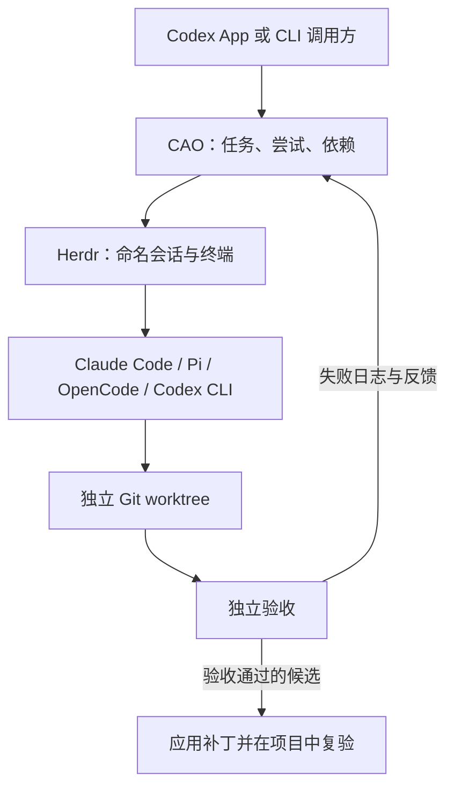

# Codex Agent Orchestrator

**基于 Herdr、Git worktree 和独立验收的 AI 编程 Agent 协调工具。**

[](https://github.com/Snseam/codex-agent-orchestrator/actions/workflows/ci.yml)
[](https://nodejs.org/)
[](LICENSE)

[English](README.md) · **简体中文**

[快速开始](#快速开始) · [工作原理](#工作原理) · [Agent 支持](#agent-支持) · [文档](#文档) · [参与贡献](CONTRIBUTING.md)

Codex Agent Orchestrator（**CAO**）是本地运行、零运行依赖的 Node.js CLI，通过 [Herdr](https://github.com/herdrdev/herdr) 协调多个编程 Agent。由 Codex App 规划工作，将范围明确的任务分配给 Claude Code 或其他 Agent 会话，独立验收通过后再整合到项目。

> **早期预览。** Claude Code 流程已通过本机端到端测试，包含受控失败与修复。其他启动适配已实现，尚未完成端到端验证。大规模协作的速度及完成率收益尚未测量。

## 为什么使用 CAO？

- **复用已有 Agent。** 通过 Herdr 管理会话，保留各 CLI 的模型和提供商配置。
- **隔离并行工作。** 为独立任务分配 Git worktree，声明修改范围、依赖和运行容量。
- **验收实际修改。** 校验结果身份与文件范围，停止 worker 后独立执行验收命令。
- **根据证据修复。** 新尝试接收失败日志，并保留前一次 worktree 中的修改。
- **检查后再整合。** 检查目标文件是否变化，应用已验收补丁，再在项目中复验。
- **保留可检查的记录。** 本地保存任务、提示、结果、终端输出、补丁和验证日志。

## 工作原理



Codex 决定做什么、如何分工；CAO 管理任务生命周期；Herdr 运行交互终端。被选中的 Agent 使用本机安装中实际可用的工具完成任务。

```text
dispatch → collect → verify → integrate
                       ↓
                     retry → collect → verify
```

每个阶段由明确的 CLI 命令驱动。派发成功不等于任务完成：`collect` 需要当前尝试的有效结果文件，`verify` 独立运行检查，不以 Agent 自报成功作为验收结论。

## 快速开始

### 1. 准备环境

- **Node.js 22+** 和 **Git**。
- 已安装 [Herdr](https://github.com/herdrdev/herdr)，且可从 `PATH` 调用。
- 一个已配置提供商和凭证的受支持编程 Agent CLI。
- 至少包含一个 commit 的目标 Git 仓库。

真实 Agent 流程在 macOS 上实测。CI 在 macOS 和 Linux 上检查离线测试；这不代表已验证各平台上的真实 Herdr 工作流。

### 2. 从源码运行

```bash
git clone https://github.com/Snseam/codex-agent-orchestrator.git
cd codex-agent-orchestrator
node bin/cao.mjs doctor
```

不需要 `npm install`，目前没有发布 npm 包。

使用本机已配置的 Claude Code，运行一个独立完整示例：

```bash
npm run smoke -- --live --happy
```

脚本创建测试 Git 项目，在 worktree 中修复一个小函数，完成验收与集成，然后停止对应 Herdr 会话。首次访问目录可能需要确认信任。若脚本暂停，应先检查保存的 run，再提供具体输入，详见[任务状态与恢复](docs/zh-CN/states.md)。

### 3. 在自己的项目中分配任务

将示例路径替换为你的目标仓库：

```bash
node bin/cao.mjs init --project /path/to/your-repo --id demo --max-parallel 2
mkdir -p work
```

将下方内容保存为 CAO 仓库中的 `work/task.json`。该例假设目标项目已有 `src/math.mjs` 和 `tests/math.test.mjs`；请按实际项目修改目标、允许路径和检查命令。

```json
{
  "id": "fix-add",
  "objective": "修复 add(a, b)，使其返回两数之和。保持现有 API 和测试不变。",
  "agent": "claude",
  "allowedPaths": ["src/math.mjs"],
  "checks": [
    {
      "name": "math tests",
      "argv": ["node", "--test", "tests/math.test.mjs"],
      "timeoutMs": 60000
    }
  ],
  "isolation": "worktree",
  "maxAttempts": 3,
  "maxChildren": 0
}
```

校验并派发任务：

```bash
node bin/cao.mjs validate --file work/task.json
node bin/cao.mjs dispatch --run demo --file work/task.json
node bin/cao.mjs collect --run demo --task fix-add --wait-ms 30000
```

根据返回状态推进流程。任务运行时继续 `collect`，需要输入时先用 `inspect --output` 查看。状态为 `submitted` 后独立验收：

```bash
node bin/cao.mjs verify --run demo --task fix-add
```

返回 `rework` 时创建修复尝试，再重新收集和验收：

```bash
node bin/cao.mjs retry --run demo --task fix-add
```

候选状态为 `accepted` 后整合补丁。所有任务完成或取消后关闭 run：

```bash
node bin/cao.mjs integrate --run demo --task fix-add
node bin/cao.mjs cleanup --run demo
```

命令返回 JSON，错误写入 stderr；`--help` 显示用法。状态保存在目标项目外，默认位于 `~/.local/state/codex-agent-orchestrator` 或 `$XDG_STATE_HOME/codex-agent-orchestrator`。协调同一项目的命令和 run 应使用相同 `--state-dir`。

## Agent 支持

| Agent | 任务字段值 | 当前验证情况 |
| --- | --- | --- |
| Claude Code | `claude` | 本机真实流程与受控失败修复已验证 |
| Pi | `pi` | 已实现启动适配；真实流程待验证 |
| OpenCode | `opencode` | 已实现启动适配；真实流程待验证 |
| Codex CLI | `codex` | 已实现启动适配；真实流程待验证 |

`agentArgs` 透传 CLI 启动参数；`nativeInstructions` 说明如何使用实际可用的原生工具。`maxChildren` 是报告契约，不是对子代理数量的监测或强制限制。详见[适配器架构](docs/zh-CN/architecture.md)。

## 验证与当前边界

- CAO 由调用方通过 CLI 显式驱动，尚无后台调度器、MCP 服务或原生子代理遥测。
- worktree 和 `allowedPaths` 是协调机制，不是文件系统沙箱。未追踪且被忽略的文件，以及外部副作用，不在 Git 快照保证范围内。
- 集成失败可能将修改留在项目。CAO 会阻止该项目接收新任务，直到恢复通过；`recover` 复验当前 checkout，不重复应用补丁。
- 直接使用 `checkout` 的任务也可能保留未验收修改。应重试该任务，或在 worker 停止后恢复。跨 run 的项目锁要求同一状态目录。
- 验证中断时保留阻塞状态，需要检查进程和证据；`resume` 不盲目重发任务或重跑检查。
- CAO 不自动 commit、push、发布、安装依赖或切换模型提供商。

初版验证包含 **67 项本地测试**和**两组真实 Claude Code 场景**。测试现已分为离线测试和显式 Herdr 集成测试。一组早期实验中，长提示需要补一次 Enter；改为任务文件后，后续正常流程在派发任务后没有补输入。两组实验均处理了新目录信任。这些是功能验证，不是性能基准。

## 开发

```bash
npm test                         # 离线测试，不需要 Agent 凭证
npm run check                    # 语法检查
npm run test:herdr                # 需要本机 Herdr，不启动 Agent
npm run smoke -- --live           # 受控失败 → 修复 → 集成
```

单独运行 `npm run smoke` 只显示说明。真实冒烟测试使用你配置的 Agent，可能产生提供商费用。修改运行时或恢复逻辑前，请阅读 [CONTRIBUTING.md](CONTRIBUTING.md)。

## 文档

| 资料 | 内容 |
| --- | --- |
| [架构与模块](docs/zh-CN/architecture.md) | CLI、状态存储、Herdr 适配、Git 隔离与验证 |
| [任务状态与恢复](docs/zh-CN/states.md) | 结果契约、重试、交互、checkout 与集成阻塞 |
| [Codex 技能草案](skills/herdr-dev/SKILL.md) | 由 Codex 驱动 CAO 的流程指引，不自动安装 |
| [更新日志](CHANGELOG.md) | 版本变化 |
| [English documentation](README.md) | 英文概览与快速开始 |

## 贡献与支持

欢迎提交问题、文档修正和范围明确的 PR。请先阅读[贡献指南](CONTRIBUTING.md)和[行为准则](CODE_OF_CONDUCT.md)，再[创建 Issue](https://github.com/Snseam/codex-agent-orchestrator/issues/new/choose)。

安全漏洞请按 [SECURITY.md](SECURITY.md) 私下报告，不要在公开 Issue 中披露。

由 [Snseam](https://github.com/Snseam) 维护。CAO 是与现有编程工具集成的独立项目。

## 许可证

[Apache License 2.0](LICENSE)。Copyright 2026 Snseam。另见 [NOTICE](NOTICE)。
